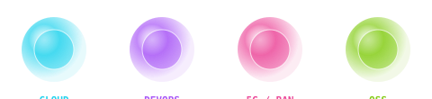

<!-- 📡 Cellular 5G / RAN diagram — animated SVG (works on github.com).
     Three macro towers, sector antennas, handover arcs, backhaul to 5GC core,
     URLLC "1 ms" badge. Pure SMIL animation, no GIF proxy issues. -->

<!-- ✨ Aurora hero — animated SVG, works on github.com (no JS) -->

<!-- 🔮 Glassmorphic stat pills (FOLLOWERS · STARS · WATCHERS · VIEWS) —
     animated counter pills. Pure SVG. -->

<!-- 📡 Live broadcast — animated radio-wave SVG next to social pills -->
<table align="center" cellpadding="0" cellspacing="0" border="0">
  <tr>
    <td align="center" valign="middle">
      
    </td>
    <td align="left" valign="middle" style="padding-left:24px;">
       
       
      
    </td>
  </tr>
</table>

<!-- 🔮 Breathing glass-orb row — pure SVG, no CSS needed -->

 

---

## 💫 About Me

🔭 I’m currently working at **Poridhi.io** as a Junior DevOps Engineer
🌱 I’m currently learning **RAN, SDN, and Python**
💬 Ask me about **GSM, LTE, 5G, CCNA, Linux, Docker**

---

## 🌐 Socials

  
  
  

---

## 💻 Tech Stack

  
  
  
  
  
  
  
  
  
  
  

---

## 📊 GitHub Stats

  
   
  
   
  

---

## 🏆 GitHub Trophies

  

---

## ✍️ Random Dev Quote

  

---

## 🐍 Contribution Snake

  <picture>
    <source media="(prefers-color-scheme: dark)" srcset="https://raw.githubusercontent.com/platane/platane/output/github-contribution-grid-snake-dark.svg">
    <source media="(prefers-color-scheme: light)" srcset="https://raw.githubusercontent.com/platane/platane/output/github-contribution-grid-snake.svg">
    
  </picture>

---

## 💖 Support My Work

  

  
   
  ✨ Try the <b>Synapse Clicker</b> mini-game on the landing page ✨

---

## 🤖 Readme Jokes

  

Powered by <a href="https://github.com/ABSphreak/readme-jokes">readme-jokes</a>

---

  
    ✨ Crafted with glassmorphism, aurora gradients &amp; love ✨ 
    Proudly built with ❤ by <a href="https://github.com/sabbirimon">sabbirimon</a>
  

